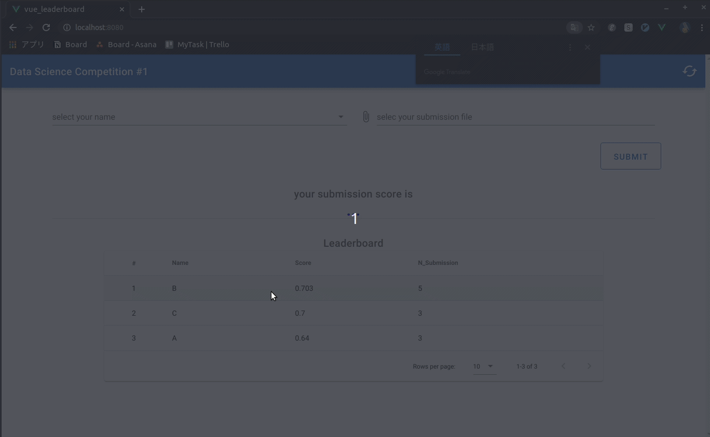

# Data Science Competition 01



## memo
- 使用したデータ・セット(private): https://github.com/fkubota/Dataset-CareerCon-2019-Help-Navigate-Robots
- heroku
	- address: https://data-science-comp-01.herokuapp.com/
	- dashboard: https://dashboard.heroku.com/apps/data-science-comp-01
	- log: `heroku logs -t -a data-science-comp-01`

- check
	- curl(local): curl localhost:5002/myapi -d "arg01=hello_flask"
    - curl(web): curl https://data-science-comp-01.herokuapp.com/test -d "test=hello_flask"

## python3 setup
1. cd data
1. pip3 install -r requirements.txt

## Project setup
```
npm install
```

### Compiles and hot-reloads for development
```
npm run serve
```

### Compiles and minifies for production
```
npm run build
```

### Lints and fixes files
```
npm run lint
```

### Customize configuration
See [Configuration Reference](https://cli.vuejs.org/config/).
